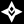

# Zenless Zone Zero Icons assets

Un set d'icônes en `svg` et en `png`.

# Statistiques

-  Points de vie
-  Pourcentage de Vie
-  Défense
-  Pourcentage de Défense
-  Puissance d'Attaque
-  Pourcentage d'Attaque
-  Dégats Critiques
-  Taux de Critique
-  Pénétration Brute
-  Taux de Pénétration
-  Impacte
-  Maitrise d'anomalie
-  Adresse d'anomalie
-  Limite d'énergie
-  Récupération d'énergie
-  Taux de Récupération d'énergie
-  Force Transperçante
-  Augmentation des Dégats de Transpercement
-  Accumulation Automatique d'Adrénaline
-  Taux de Génération d'Adrénaline
-  Adrénaline Maximum
-  Augmentation des Dégats électriques
-  Augmentation des Dégats ethétiques
-  Augmentation des Dégats de feu
-  Augmentation des Dégats de givre
-  Augmentation des Dégats de glace
-  Augmentation des Dégats physiques
-  Augmentation des Dégats de sépia
